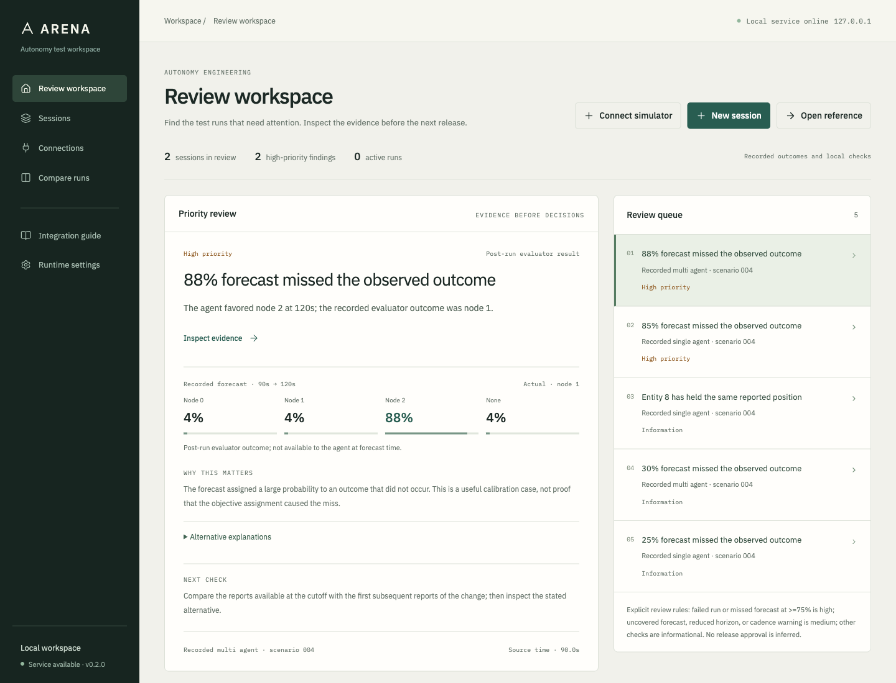
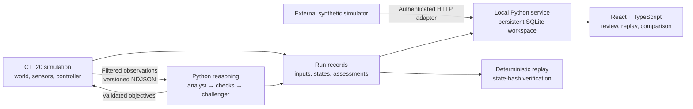
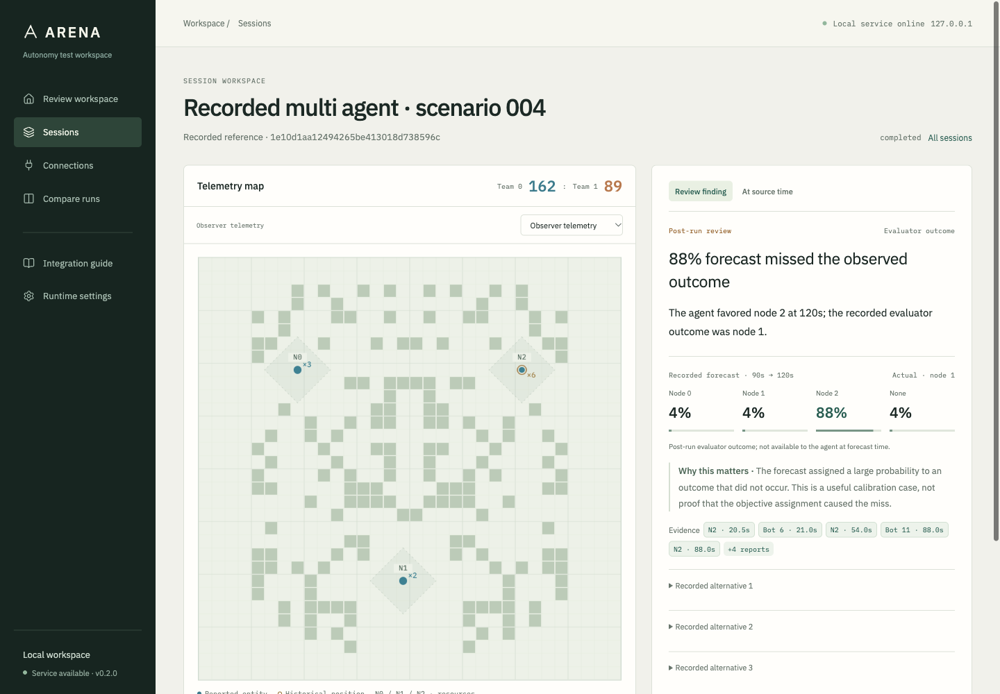

# Arena Intelligence

**Simulation, reasoning, and replay for defense autonomy engineering.**

Arena is a local evaluation workspace for studying how reasoning agents behave when observations are incomplete, reports arrive late, and inference takes longer than a control update. It connects a deterministic C++ simulation to asynchronous Python agents, then makes every recommendation, rejection, and outcome available for review.

The core engineering question is practical: **can a reasoning agent produce useful, evidence-grounded objectives while a faster controller keeps operating?** Arena provides the simulation, validated interfaces, failure recovery, and experiments needed to investigate it.

[Download v0.2.0](https://github.com/ysham123/Arena-Intelligence/releases/tag/v0.2.0) · [Installation](docs/install.md) · [Integration contract](docs/integration.md) · [Measured results](reports/engineering-report.md)



## The engineering workflow

1. **Connect a simulator.** Create an authenticated local receiver and send versioned events through the Python/HTTP adapter. Sessions persist across restarts.
2. **Review what needs attention.** The queue surfaces failed runs, high-probability forecast misses, reduced forecast horizons, and explicit telemetry checks.
3. **Inspect the evidence.** Open the relevant moment, trace citations to source records, and compare observation time with delivery time. Read the recorded alternatives alongside the forecast.
4. **Compare configurations.** Review outcomes, forecast coverage, accuracy, Brier score, latency, and cost. Check whether scenario conditions match before interpreting a difference.
5. **Reproduce the run.** Replay accepted inputs at their recorded application ticks and verify native state hashes without making new model calls.

The included recordings contain actual assessments from the frozen experiments. The lead review case is an 88% forecast that missed its outcome. The workspace preserves that failure and the evidence behind it.

## Why this matters for defense AI

Defense autonomy research puts pressure on the boundary between reasoning and execution. An expensive model can receive stale information, offer an unsupported explanation, or return after its recommendation is useful. A test environment must expose those failures and keep them in the evaluation.

Arena implements that boundary explicitly:

| Engineering concern | Implemented behavior |
| --- | --- |
| Partial observations | Agents receive filtered sightings with evidence IDs and timestamps. Hidden state and evaluator labels remain separate. |
| Different execution rates | C++ advances at a fixed 10 Hz in paced mode while one Python reasoning cycle runs asynchronously. |
| Uncertain explanations | An analyst proposes hypotheses and evidence checks; a challenger examines the results and returns a testable forecast and complete assignment. |
| Late or invalid advice | A 20-second cycle deadline, semantic validation, assignment expiry, and a deterministic fallback constrain what the controller accepts. |
| Traceable execution | Assignments apply atomically at a tick boundary. Delivery, application, rejection, and supersession remain in the record. |
| Honest evaluation | Every scheduled opportunity contributes to coverage. Score, forecast quality, latency, and cost are reported separately. |

Version 0.2 uses a fictional resource-control game and explicitly synthetic adapter data. The project supports simulation research and engineering review. Real-world military analysis, operational deployment, and integrations with specific defense or robotics platforms are outside this release. There is no affiliation with or endorsement by Anduril.

## Architecture



The model recommends resource objectives; deterministic C++ controllers choose individual movements. Only the simulation thread mutates world state. Bounded queues keep pipe I/O outside the update loop, and replay-critical recording failure explicitly fails the run.

The browser, fonts, icons, and two reference recordings are bundled locally. The service binds to loopback. Provider credentials stay in the Python environment; opening the workspace or its recordings makes no paid inference calls.



## Measured results

The original experiments used four held-out map seeds, three scripted opponent policies, and both mirrored starting sides: 24 conditions per configuration. These results concern the recorded synthetic arena and its frozen model configuration.

| Measurement | Recorded result |
| --- | --- |
| Native update p99, 12 / 64 / 256 bots | 6.958 / 30.167 / 148.959 µs on Apple M2 Pro; `Engine::step` only |
| Closed-loop wins, analyst + challenger / single agent | 21 / 16 wins across 24 conditions each |
| Mean friendly score, analyst + challenger / single agent | 288.29 / 236.71 |
| Forecast accuracy on identical observation histories | 120/144 (83.33%) / 119/144 (82.64%); 100% coverage for both |
| Mean latency on identical observation histories | 11.59 / 5.60 seconds |
| Exact replay audit | 102 runs, 177,052 states, zero API calls |
| Product verification | 131 offline Python tests and five frontend tests passed locally; clean macOS install and restart verified |

The challenger produced one additional correct forecast out of 144 matched opportunities while taking approximately twice as long. The closed-loop score difference is exploratory: assignments change subsequent observations, conditions are correlated, and each condition has one stochastic model run. The data does not establish a general multi-agent advantage.

Native timings exclude route construction, serialization, transport, recording, and inference. See the [engineering report](reports/engineering-report.md) for hardware, methods, memory use, resilience tests, and limitations; the [matched-input report](reports/matched-final.md) for forecast comparisons; and [product validation](reports/product-validation.md) for the application checks.

## Get started

The [downloadable install kit](https://github.com/ysham123/Arena-Intelligence/releases/download/v0.2.0/arena-intelligence-local-0.2.0.zip) contains the application wheel, installer, and adapter examples. Install [uv](https://docs.astral.sh/uv/getting-started/installation/), extract the kit, then run:

```sh
python3 install_local.py \
  --wheel arena_intelligence-0.2.0-py3-none-any.whl \
  --destination ../arena-local \
  --start
```

Open **http://127.0.0.1:8767**. The installer creates a separate Python environment. The first installation downloads dependencies; the installed interface serves its assets locally. A model key, Node build, and C++ compiler are unnecessary for recorded sessions and external adapters.

For a source checkout:

```sh
git clone https://github.com/ysham123/Arena-Intelligence.git
cd Arena-Intelligence
uv sync --frozen
uv run arena serve
```

With the service running, send an example synthetic stream from another terminal:

```sh
python3 tools/simulation_adapter.py
```

The adapter creates a receiver, streams a session, and prints its session ID without printing its token. The [integration guide](docs/integration.md) defines the event schema, timestamp semantics, validation, retries, and limits.

## Build and verify

New native matches require a C++20 compiler, CMake 3.24+, and Ninja. Recorded sessions and external adapters work without the native build.

```sh
uv sync --frozen --group dev
cmake -S . -B build/release -G Ninja -DCMAKE_BUILD_TYPE=Release
cmake --build build/release
ctest --test-dir build/release --output-on-failure
ARENA_ENGINE="$PWD/build/release/arena-sim" uv run pytest -q
uv run arena run --engine build/release/arena-sim --backend mock --run-dir runs/demo
uv run arena replay runs/demo --engine build/release/arena-sim
```

Frontend development uses Node 24 and the locked dependencies in `frontend/`. Run `npm ci`, `npm run test`, and `npm run build` there. The compiled interface is already included in the Python package.

[Hosted CI](https://github.com/ysham123/Arena-Intelligence/actions/runs/37219973436) passed all four jobs for the published application code: Linux and macOS native/Python tests, frontend tests and build, and Linux AddressSanitizer/UndefinedBehaviorSanitizer checks. The [verification record](reports/github-ci.json) identifies the tested commit. Paid model calls are excluded from CI. Live Claude runs require explicit paid opt-in and use a persistent ledger with a hard $55 project ceiling; see [development and experiments](docs/development.md) before running them.

## Documentation and reproducibility

| Resource | Contents |
| --- | --- |
| [Installation](docs/install.md) | Isolated setup, optional native build, workspace persistence, upgrades |
| [Integration contract](docs/integration.md) | Working Python adapter, authenticated event ingestion, limits |
| [Architecture](docs/architecture.md) | State ownership, asynchronous reasoning, validation, recovery |
| [Protocol](docs/protocol.md) | Native lifecycle, observations, assessments, and results |
| [Product design](docs/design.md) | Review workflow, information boundaries, interface decisions |
| [Development and experiments](docs/development.md) | Build commands, model configuration, budget, experiment reproduction |
| [Engineering report](reports/engineering-report.md) | Native performance, resilience, measured model comparisons |
| [Product validation](reports/product-validation.md) | Installation, browser, adapter, and regression checks |

The repository includes source, the recorded demo, and measured reports. The [release](https://github.com/ysham123/Arena-Intelligence/releases/tag/v0.2.0) also includes the packaged application and the complete experiment archive. Extract the source and experiment archives together to audit the saved runs without new API calls. [Source hashes](reports/release-manifest.json) and [experiment hashes](reports/experiment-records-manifest.json) accompany them.
