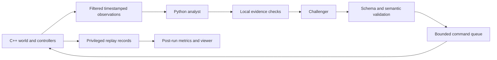

# Architecture and engineering decisions

## Ownership and data flow

The C++ simulation thread owns integer world state. Reader and writer threads handle pipe traffic through bounded queues. Python drains both stdout and stderr concurrently, retains permitted observation history, and schedules one reasoning cycle at a time. The subprocess boundary keeps network latency and Python failures outside the native update loop.

Bots use the same native pathfinding/controller in every experimental configuration. Reasoners submit a complete mapping from friendly bot IDs to resource-node IDs. The engine checks it and applies the mapping atomically at a simulation boundary. This keeps controller differences from contaminating the reasoning comparison.

## Time and late work

Virtual time advances in fixed ticks. Paced runs sleep against a monotonic clock; the game equations do not use wall-clock elapsed time. An observation records its source cutoff, each sighting's observation time, and each report's delivery time.

For a cutoff at tick C:

| Event | Tick/time |
| --- | --- |
| Native observation captured | C |
| Whole reasoning cycle deadline | 20 wall-clock seconds |
| Last native acceptance boundary | C + 200 ticks |
| Assignment application | receipt tick + 1 |
| Forecast evaluation | C + 300 ticks |
| Objective assignment expiration | C + 450 ticks |

A model returning 12 seconds after the cutoff has 18 simulated seconds remaining in its forecast. The assessment's age remains visible. A response belonging to another run, an invalid request, or expired work is rejected. Historical assessments remain available for inspection. A failed cycle sends a recorded fallback notification. Only the latest outstanding request can clear advice; nearest objectives take effect at the next tick.

The schedule uses cutoffs separated by 300 ticks, so a normally accepted assignment remains in effect through its forecast horizon before the next cycle's assignment can apply. Superseded forecasts are tracked separately. Batch-mode hosts pause at planning boundaries and use free deterministic backends; replay injects saved responses at their original ticks.

## Evidence and evaluation boundary

Agent input contains known terrain, exact friendly state, received opponent sightings, and permitted evidence. Node occupancy reports count only sensor-visible opponents and provide a lower bound. A zero count does not establish emptiness. Local checks operate on that same restricted history. The compact model context transmits terrain once, complete current friendly state, latest per-bot received sightings, at most 32 representative reports, and bounded past score snapshots. It declares omitted records and coverage. Initial and selected checks operate on all retained permitted records; compacting a prompt does not remove history from local validation. Public scoring, movement, sensing, and expiration rules are identical in both modes. Full world states and hidden policy labels are written to evaluator records. They are read after a run for scoring and by the explicitly labeled truth view in the replay artifact.

Each explanation includes an alternative and references event IDs. Citation membership is mechanically checked. Membership alone does not establish that a natural-language claim follows from its evidence; the challenger, future prediction scores, and human replay inspection provide additional checks. Model confidence is evaluated as a forecast, rather than treated as a calibrated probability by default.

The forecast category is the node with the largest opposing occupancy within distance two at its horizon, with stable tie-breaking and a `none` category. This is an observable game outcome. Accuracy and Brier score use only covered forecasts; coverage always uses all scheduled planning opportunities, including timeouts and rejected plans.

## Two complementary comparisons

The closed-loop tournament measures strategy and score under identical seeds, controller code, policies, starting sides, planning cutoffs, and spending allowances. Different assignments change friendly movement and therefore later sensor coverage. Those streams are not literally identical.

The matched-input forecast benchmark supplies the exact same recorded permitted observation history to frequency, single-agent, and multiple-agent configurations. Input fingerprints are checked per opportunity. Hidden evaluation records are opened only after all inference tasks finish. No native acceptance or assignment application is claimed in this benchmark. Its conditional forecast labels are supported by the current scripted opponents' trajectory independence from friendly assignments, verified across all policies and both sides. A reactive opponent would invalidate that shortcut and require a different evaluator.

## Determinism and replay

Seeds reproduce internal simulation randomness. External inputs also need recording: responses, receipt ticks, assignment application ticks, and lifecycle commands. Replay consumes those records and compares canonical state checksums. It makes zero model calls. Replay also checks the final result and tick so a truncated state log cannot pass verification. Stable actor order, explicit RNG behavior, integer coordinates, and deterministic pathfinding support repeatability.

A replay checksum is an integrity/reproducibility check, not a cryptographic security claim. Exact replay guarantees apply to the recorded engine/protocol version. Dependency and compiler information accompany benchmark results.

## Cost controls

The SQLite ledger uses transactional reservations. Every dispatch reserves a conservative worst-case input/output charge against both the project ceiling and the selected bucket. Successful calls settle to their measured token usage. Definitive API request rejections before generation settle to zero. Ambiguous transport failures and cancellations retain their reservation so restarting the CLI cannot silently recover potentially spent credit.

The hard $55 ceiling is a local guard for calls made through this project. An optional lower ceiling is persisted and cannot be raised by omitting the configuration later. It does not inspect account balance or account usage from other applications. Changing model pricing requires changing and reviewing the pricing configuration. Single and multiple agent cycles share an 8,192-token aggregate output allowance and a $5 cycle spending ceiling. Both receive identical initial objective-visit, occupancy-trend, and report-timing summaries. The analyst can request up to three follow-up checks. The single call cannot revise its answer after those selected results arrive; the multi challenger can. This is the documented difference in workflow. Model access errors fail clearly; they do not silently switch models.

## Scope of the evidence

Offline tournaments establish simulator correctness and test the experimental plumbing. Mock reasoning demonstrates orchestration and replay, and is labeled accordingly in reports. Live pilot results establish API integration. A claim that multiple agents improve strategy requires a completed held-out comparison with budgets and sample sizes reported.

This repository models a fictional resource game. Its outputs describe simulated bots and objectives.

## Local product boundary (0.2)

The downloadable app adds a local HTTP service around the simulation tooling.
It owns connection records, receiver credentials, event validation, persisted
sessions, and static UI delivery. The native engine and paid reasoning code keep
their existing protocol and budget boundaries. Opening the app or its recorded
reference does not dispatch inference.

The integration API accepts a versioned, explicitly synthetic event stream.
`source_time` is the simulator's clock; `received_at` is the service's UTC receipt
time. A client identifies a session with a stable external ID and sends monotonically
increasing event sequence numbers. Repeating an identical accepted event is safe;
changing an already accepted sequence is a conflict. The HTTP response is the
receipt, so an adapter should retain unacknowledged batches and retry them rather
than inventing a new sequence after an ambiguous network result.

Receiver tokens are separate from model credentials. A connection token grants
write access to that connection's simulated sessions. It is issued once to the
setup flow and stored as a hash. The service binds to loopback and does not expose
the repository or runtime directory as a general-purpose file server. Static UI
files and sample assets come from the installed Python package.

### Evidence-based local checks

The generic adapter can carry an upstream assessment. It also receives transparent
local checks from `product_insights.py`, without an API call:

| Check | Trigger | Interpretation boundary |
| --- | --- | --- |
| Stationary entity | At least four identical reported positions over ten source seconds; no sample gap over five seconds | A held position is compatible with intended behavior, stale reporting, or a controller issue. |
| Snapshot interval | A gap of at least five seconds and three times the preceding five intervals' median | Source cadence changed; this alone does not prove packet loss. |
| Observed grouping | At least 60% of four or more same-group entities occupy one quadrant, increasing by at least two over ten seconds | Counts use the same reported identities and world size; no intent is inferred. |

Checks include canonical event IDs, the rule, the measured values, and an alternative
explanation. Missing entities break the stationary window. Duplicate timestamps do
not count as extra samples. A cutoff excludes later observations. These rules are
diagnostics, not results of the frozen Claude comparison.

The browser labels origins and separates playback from current receipt status.
External adapters must supply their permitted observation stream; the service does
not infer an upstream simulator's visibility rules. The built-in arena reference
retains its explicit observer/evaluator distinction.
